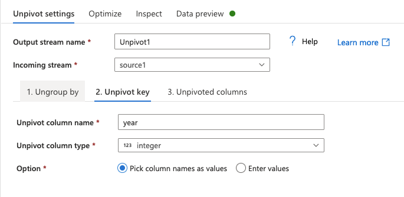

# Tutorial 1

This tutorial describes how to use the Azure Data Factory to transform and load a single file into the Azure SQL Database, following a common data pipeline architecture. The pipeline that you create in this tutorial un-pivots global CO2 emission data, stores them in an Azure storage account and ingests them into the Azure SQL Database. This tutorial teaches the following steps in the Azure Data Factory.

- Create a new linked service.
- Create a new dataset.
- Create a data flow to transform the dataset.
- Create a pipeline to run the data flow.
- Run the pipeline.
- Monitor the pipeline run.
- Review results

## Prerequisites

- Data Factory
- Two storage accounts
    - The first storage account has a `data` container containing the `API_EN.ATM.CO2E.KT_DS2_en_csv_v2_3358949.csv` file.
    - The second storage account has a `conformed` container. Ensure `Hierarchical namespace` is enabled.
- Azure SQL Database (Serverless)
- (Optional) Azure DevOps repository

## Transform and Load Data From Blob To Blob

Suppose that there is a raw file (global CO2 emission), which has been extracted from a source database and landed in the `raw layer`. The picture below illustrates a typical architecture of data pipelines and the red rectangle is covered in this section, where the raw file is transformed (i.e. unpivot) and loaded to a blob storage.

1. Create a new Linked service.

    a. Before transforming the raw file, a linked service should be created to read the file. Click `Manage` and then `Linked services` on the left pane. Click `New` to create a new linked service. Optionally, create a new feature branch if the Data Factory is integrated with Git.

    

    b. Select `Azure Blob Storage` and `Continue`.

    

    c. Enter `Name` and select the `storage account name`, where the raw file is stored, to configure the linked service details as below.

    

    d. Click `Test connection` to check if the linked service is set up properly, and click `Create`.
    
2. Create a new Dataset.

    a. Click `Author` on the left menu, click `+ (plus)` button and then select `Dataset`.

    

    b. Select `Azure Blob Storage` and click `Continue`.

    

    c. Select `DelimitedText` and click `Continue`.

    

    d. Enter `Name`, select "LS_BS_DF1" in the `Linked service` and click `Browse` to select the raw file, `API_EN.ATM.CO2E.KT_DS2_en_csv_v2_3358949.csv`. Tick `First row as header`, select `From sample file` and then click `Browse` to select the header file `headers.csv`. Click `OK`.

    

    e. (Optionally) If you have integrated with Azure DevOps, you can see the `co2` dataset appears in the repository when you save it.

    

    f. Note that `Preview data` do NOT show data in the correct form because the actual data starts at the 6th row.

    

    g. Verify that the headers appear correctly by clicking `Schema`.

    

    
3. Transform Data
    
    a. Create a data flow to transform the raw file. Click `+ (plus)` button and then select `Data flow`.

    

    b. Click `Add Source` to configure the raw file.

    

    c. Select the `co2` dataset and enter `4` in the `Skip line count`.

    

    d. Click `Data flow debug` on the top menu and select `Data preview` to check if the raw data appear correctly.

    

    e. Click `+` sign next to `source1` and select `Unpivot`.

    

    f. Add `Country Name, Country Code, Indicator Name and Indicator Code`.

    

    g. Enter `year` and set `integer` in the `Unpivot key`.

    

    h. Set the unpivoted columns as `co2_emissions` with `string` data type. Tick `Drop rows with null`

    

    i. Click `Data preview` to check if the raw data appear correctly.

    

    j. Click `+` sign next to `Unpivot1` and select `Sink`.

    

    k. `Sink` defines the output data, un-pivoted CO2 emission. First, create a new linked service, `LS_BS_DF2` like `LS_BS_DF1` to store conformed files in an Azure storage account (i.e. Conformed Layer in the pipeline architecture).
    
    

    l. Create a new dataset, `co2_unpivoted` like `co2` dataset.

    

    

    

    

    m. Select the `co2_unpivoted` dataset.

    

    n. Select `Output to single file` and enter `co2_unpivoted.csv` file name.

    

    o. Click `Data preview` to check if the data appear correctly.

    

    p. Enter the data flow name, `unpivot_dataflow` and click `Save`.

    

3. Create a pipeline to orchestrate the data flow.

    a. Click `+ (plus)` button and select `Pipeline`.

    
    
    b. Drag and drop `Data flow` onto the right canvas.

    

    c. Name `Unpivot` and select `unpivot_dataflow` in the `Data flow`.

    

    

    d. Click `Debug` button to run the pipeline and verify the pipeline runs successfully.

    

    

    e. Also, check if the `co2_unpivoted.csv` file is created successfully in the conformed blob storage.

    

## Load Data from Blob to Database

Now the raw file (global CO2 emission) is transformed and stored in the format to be ingested in a database. The picture below illustrates a typical architecture of data pipelines and the red rectangle is covered in this section, where the transformed file is loaded to a database.

1. First, create a linked service to connect to the Azure SQL database.

    a. Click `Manage` and `New` to create a new linked service.

    

    b. Click `Azure SQL Database` and `Continue`.

    

    c. Enter `LS_SQLDW` and the authentication details.

    

    d. Test the connection. If it fails due to firewall, add the client IP address to the Azure SQL database and `Save`.

    

2. Go back to the Data Factory and create a new dataset, `co2_sqldw`, which creates a table, `dev.co2` in the database.

    a. Click `Author`, select `+ (plus)` button and then `Dataset`. Select `Azure SQL Database` and click `Continue`.

    

    b. Enter `co2_sqldw` and select the linked service, `LS_SQLDW` created above. Set `dev.co2` in the table name. Click `OK` and `Save`.

    

3. Drag and drop a `Copy data` activity onto the pipeline. Name it `Load to DW` and connect from `Unpivot` to `Load to DW`. 

    

4. Select `co2_unpivoted` in the `Source dataset`. Click `Preview data` to ensure that the data appears correctly. Note that we are selecting `Wildcard file path` and enter `* (asterisk)` even though we have only one file, `co2_unpivoted.csv`.

    

5. Configure `Sink`. Select `co2_sqldw` dataset and `Auto create table`.

    

6. Click `Save` and press `Debug` button to test the pipeline.

    

7. Monitor the pipeline and check the result in the database by running a query, `select top 1000 * from dev.co2`.

    

    
