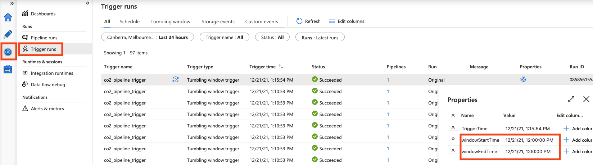

Suppose that files containing delta data are generated from a source database and stored in an Azure Storage Account. The files are time-partitioned, so we can schedule a data pipeline at an interval and can backfill data in the case of a pipeline failure. The following structure shows typically time-partitioned (`yyyy/MM/dd/HH`) files.

```
.
├── 2021
│   └── 12
│       └── 31
│           ├── 22
│           │   └── file1.csv
│           └── 23
│               └── file2.csv
└── 2022
    └── 01
        └── 01
            ├── 00
            │   └── file3.csv
            ├── 01
            │   └── file4.csv
            └── 02
                └── file5.csv
```


Tumbling window triggers fire a pipeline at a periodic time interval, such as every 15 minutes, 1 hour or 1 day etc. Assuming that the raw files are extracted and stored in the time-partitioned format in an Azure Storage Account, we are going to use a tumbling window trigger to process the raw files at an hour interval.


1. Open the `co2_pipeline` pipeline in the Azure Data Factory.

2. Add a parameter, `windowStart` to the pipeline to assign the window start time of a tumbling window trigger.

    

3. Create a tumbling window trigger to fire the pipeline every hour.

    a. Click `Add trigger` and `New/Edit`.

    

    b. Click `New` to create a new trigger.

    

    c. Enter the trigger name, `co2_pipeline_trigger`, select `Tumbling window` type and set the `Start Date` to run every 1 hour. Press `OK`. Note that the time zone is UTC.

    

    d. Enter the parameter (windowStart) value, `@trigger().outputs.windowStartTime` which is the start of the tumbling window. Click `Save`. As a result, whenever the pipeline is triggered, `@trigger().outputs.windowStartTime` value is assigned to the parameter `windowStart`.

    

4. Edit the `unpivot_dataflow` data flow to ingest time-partitioned files.

    a. Open the `unpivot_dataflow` data flow
    
    b. Add parameters (`year`, `month`, `day` and `hour`) to the data flow to pass the pipeline parameter, `windowStart`.

    

    c. Click `source1` in the data flow and enter the wildcard paths, `concat($year, '/', $month, '/', $day, '/', $hour, '/*.csv')` in the source options. Tick `Allow no files found` so that the pipeline does not fail when there is no file to process.

    

    d. Click `sink1` and `Settings` in the data flow and then click `Add dynamic content` to open the Visual expression builder.

    

    e. Enter `concat($year, '/', $month, '/', $day, '/', $hour, '/', "co2_unpivoted_", $year, $month, $day, $hour, ".csv")` to set the file name and path. Click `Save and finish`.
    
    

    f. Save

5. Edit the `Unpivot` data flow activity in the pipeline to pass the pipeline parameter, `windowStart`.

    a. Open the `co2_pipeline` pipeline.

    b. Click `Unpivot` data flow activity.

    c. Select `Parameters`, click the Value area of the `year` parameter and then select `Pipeline expression`.

    

    d. Enter `@{formatDateTime(pipeline().parameters.windowStart,'yyyy')}` to pass the year of the trigger start time. Click `OK`.

    

    e. Repeat steps c and d to enter `@{formatDateTime(pipeline().parameters.windowStart,'MM')}`, `@{formatDateTime(pipeline().parameters.windowStart,'dd')}` and `@{formatDateTime(pipeline().parameters.windowStart,'HH')}` for the parameters, `month`, `day` and `hour`.

    

    f. Save

6. Debug the `Unpivot` data flow activity to check if the time-partitioned files are transformed as expected.

    a. Activate `Data flow debug` and click the `Unpivot` data flow activity and click the red dot to debug until the activity.

    

    b. Go to the raw layer storage account and upload a time-partitioned file.

    
    
    c. Go back to the `co2_pipeline` and click `Debug`.

    

    d. Enter a triggered window start, `2021-12-20T01:00:00Z` and click `OK`. Note that it is UTC and the raw file is in the `data/2021/12/20/01` path.

    
    
    e. Monitor the pipeline run.

    

    
    
    f. The raw file is transformed and stored in the partition, `conformed/2021/12/20/01/co2_unpivoted_2021122001.csv`.

    

7. We tested the `Unpivot` data flow and are going to load the conformed file into the Azure SQL Database at an hourly interval.

    a. Disable debug by clicking the red dot.

    b. Click the `Load to DW` copy data activity
    
    

    c. select `Source` and edit the wildcard paths by clicking `Add dynamic content`.

    

    d. Enter `@{formatDateTime(pipeline().parameters.windowStart,'yyyy')}/@{formatDateTime(pipeline().parameters.windowStart,'MM')}/@{formatDateTime(pipeline().parameters.windowStart,'dd')}/@{formatDateTime(pipeline().parameters.windowStart,'HH')}` to set the time-partition, `yyyy/MM/dd/HH`. Click `OK`.

    

    e. Add the `.csv` extension to the wildcard paths to be more accurate.

    

    f. Save

8. Debug to check if the time-partitioned file is loaded to the Azure SQL Database.

    a. Go to the Azure SQL Database, click `Query editor` and login.

    b. Truncate the `dev.co2` table by running a query, `truncate table dev.co2`.

    

    c. Go back to the Data Factory and click `Debug`.

    

    d. Enter a triggered window start, `2021-12-20T01:00:00Z` and click `OK`.

    e. Monitor the pipeline run.

    

    f. Go back to the `Query editor` and run a query `select * from dev.co2`.

    

9. We have tested that the pipeline works end to end. It's time to publish the pipeline to run as per the schedule (i.e. an hour interval).

    a. Check out the delta datasets in the tutorial directory, `data\tutorial_2`. `delta_1.csv` contains the global CO2 emission from countries B-N and `delta_2.csv` from countries O-Z.

    b. We place the delta datasets in the raw layer storage account. Note that the files have been placed in the `02` and `03` directories respectively because the UTC was 2021-12-21 2:00 am, meaning that it processes `delta_1.csv` when the pipeline is triggered because its tumbling window is between 2021-12-21 1:00 am to 2021-12-21 2:15 am.

    ```
    data
    ├── 2021
    │   └── 12
    │       └── 21
    │           ├── 01
    │           │   └── delta_1.csv
    │           └── 02
    │               └── delta_2.csv
    ```
    
    c. Go back to the Data Factory. Click `Save all` and `Publish` on the top menu. Note that you can publish from the main branch only and the pipeline is triggered only if it is published.

    

    

    d. Monitor the pipeline runs triggered at an hourly interval. Click `Monitor` and `Trigger runs`. Notice that many pipelines have been triggered because the trigger automatically backfills from the trigger start date time you've set, up to 2021-12-21 2:15 am UTC (i.e. 2021-12-21 1:15 pm AEST).

    

    e. Clicking `Pipeline runs` shows all the backfilled pipelines in progress.

    

    f. Click `parameters` to see the parameter values for the pipeline run.

    

    g. Go to the conformed layer storage account. Notice that a time-partitioned file is created in the `2021/12/21/01` directory because the triggered time `2021-12-21 2:15 am UTC` covers a window from `2021-12-21 1:00 am` to `2021-12-21 2:00 am`.

    

    h. Click the file `co2_unpivoted_2021122101.csv` and click `Edit` to view the file content. Notice that it contains unpivoted `delta_1.csv` containing countries from B to N.

    

    i. Go back to the Query editor. Run a query `select distinct [Country Name] from dev.co2` to check if countries starting with B exist.

    

    j. Note that `delta_2.csv` has not been processed and would be processed at the next interval.
